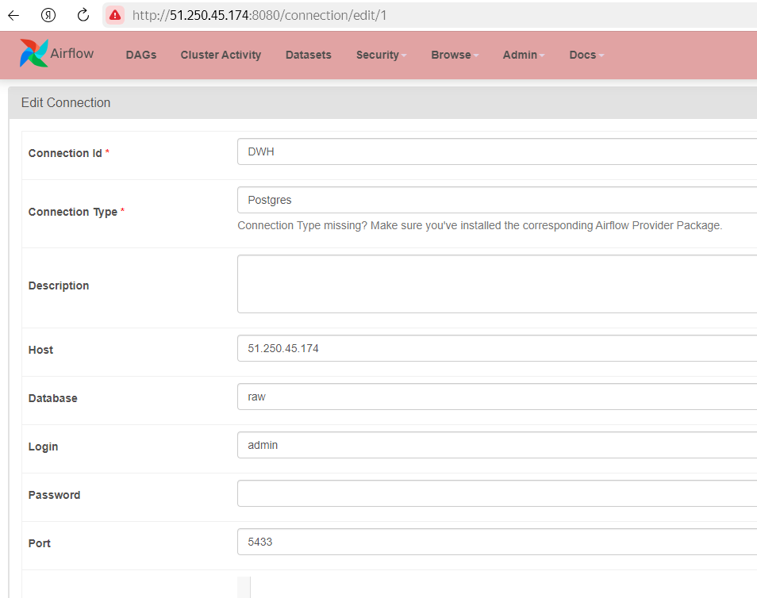
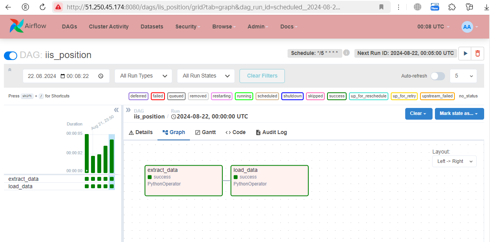
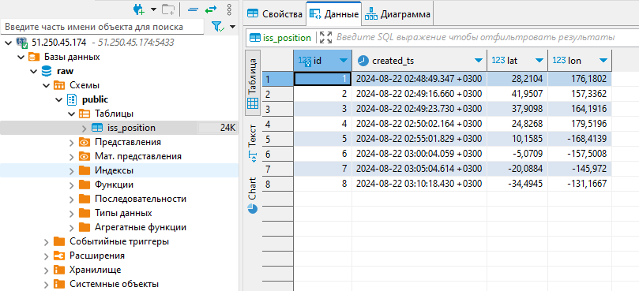

# 1. Запускаем сервисы в docker
```
docker compose up --build -d
```

# 2. Добавляем connection

<a href="screen/connection.png" target="_blank"></a>

# 3. Запускаем DAG «iss_position»

<a href="screen/dag.png" target="_blank"></a>

# 4. Проверяем результат

<a href="screen/result.png" target="_blank"></a>